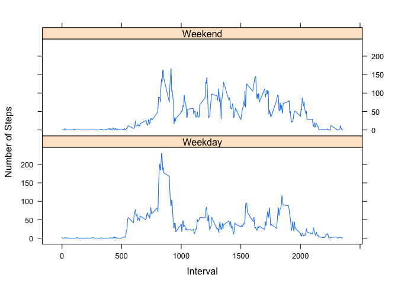

# Reproducible Research: Peer Assessment 1


## Loading and preprocessing the data  

**1. Load the data (i.e. read.csv()).**  
**2. Process/transform the data (if necessary) into a format suitable for your analysis.**  
    
 - Reads in data  
 - Changes dates to POSIXct  
 

```r
data <- read.csv("activity.csv", header = TRUE)
data$date <- as.POSIXct(data$date)
```
  
==========================================================================  
  
## What is mean total number of steps taken per day?
**1. Calculate the total number of steps taken per day**  
    
 - Creates dataframe of total total steps taken per day
 

```r
 library(dplyr)
```

```
## 
## Attaching package: 'dplyr'
## 
## The following object is masked from 'package:stats':
## 
##     filter
## 
## The following objects are masked from 'package:base':
## 
##     intersect, setdiff, setequal, union
```

```r
    groupData1 <- group_by(data, date, "days")
    meanData <- summarize(groupData1, sum(steps))
    meanData <- meanData[, -2]
    colnames(meanData) <- c("date", "total_steps")
    meanData
```

```
## Source: local data frame [61 x 2]
## Groups: date
## 
##          date total_steps
## 1  2012-10-01          NA
## 2  2012-10-02         126
## 3  2012-10-03       11352
## 4  2012-10-04       12116
## 5  2012-10-05       13294
## 6  2012-10-06       15420
## 7  2012-10-07       11015
## 8  2012-10-08          NA
## 9  2012-10-09       12811
## 10 2012-10-10        9900
## ..        ...         ...
```
  
**2. Make a histogram of the total number of steps taken each day**  
  
 - Plots histogram of number of steps taken each day

```r
hist(meanData$total_steps, freq = TRUE, breaks = 25, main = "Histogram of Steps Per Day", xlab = "Steps Per Day", col = "blue")
```

 
  
**3. Calculate and report the mean and median of the total number of steps taken per day**  

```r
mean(meanData$total_steps, na.rm = TRUE)
```

```
## [1] 10766.19
```

```r
median(meanData$total_steps, na.rm = TRUE)
```

```
## [1] 10765
```
*Mean = 10766.19, Median = 10765*  
  
==========================================================================  
  
## What is the average daily activity pattern?
**1. Make a time series plot (i.e. type = "l") of the 5-minute interval (x-axis) and the average number of steps taken, averaged across all days (y-axis)**  
  
 - Removes null instances from data 
 - Creates table of average steps per interval across all days  
 - Plots line graph of average steps for intervals  
 - Adds annotation to x axis
 

```r
compdata <- na.omit(data)

groupData2 <- group_by(compdata, interval)
intervalData <- summarize(groupData2, mean(steps))
colnames(intervalData) <- c("interval", "mean_steps")

with(intervalData, plot(interval, mean_steps, type = "l", main = "Avg. Steps Per Time Interval", xaxt = "n", ylab = "Average Steps", xlab = "Time (Military Style)"))

timeseq <- seq(from = 0, to = 2400, by = 100)
axis(side = 1, at = timeseq, las = 2)
```

 
  
**2. Which 5-minute interval, on average across all the days in the dataset, contains the maximum number of steps?**  

```r
subset(intervalData, mean_steps == max(intervalData$mean_steps))
```

```
## Source: local data frame [1 x 2]
## 
##   interval mean_steps
## 1      835   206.1698
```
*Max avg. steps at 8:35 am = 206.1698 steps*  
  
==========================================================================    
  
## Imputing missing values  
**1. Calculate and report the total number of missing values in the dataset (i.e. the total number of rows with NAs)**

```r
step_nas <- is.na(data$steps)
sum(step_nas)
```

```
## [1] 2304
```
**2. Devise a strategy for filling in all of the missing values in the dataset. The strategy does not need to be sophisticated. For example, you could use the mean/median for that day, or the mean for that 5-minute interval, etc.**  
  
**3. Create a new dataset that is equal to the original dataset but with the missing data filled in.**  
  
 - Creates data frame that replaces NA values with the average value for that time interval across all days 


```r
repData <- data %>% 
        group_by(interval) %>%
        mutate(steps = replace(steps, is.na(steps), mean(steps, na.rm=TRUE)))

groupDataFull <- group_by(repData, date, "days")
meanDataFull <- summarize(groupDataFull, sum(steps))
meanDataFull <- meanDataFull[, -2]
colnames(meanDataFull) <- c("date", "total_steps")
```
**4. Make a histogram of the total number of steps taken each day and Calculate and report the mean and median total number of steps taken per day. Do these values differ from the estimates from the first part of the assignment? What is the impact of imputing missing data on the estimates of the total daily number of steps?**


```r
hist(meanDataFull$total_steps, freq = TRUE, breaks = 25, main = "Histogram of Steps Per Day w/ NAs Replaced", xlab = "Steps Per Day", col = "blue")
```

 

```r
mean(meanDataFull$total_steps, na.rm = TRUE)
```

```
## [1] 10766.19
```

```r
median(meanDataFull$total_steps, na.rm = TRUE)
```

```
## [1] 10766.19
```
*The mean value, not surprisingly, has not changed, as the method for replacing NA values only added more "average" steps days to the dataset. The median is now the daily mean (again, not to surprising; you can see the large spike in days with the average number of steps in the histogram).*  
  
==========================================================================  
  
## Are there differences in activity patterns between weekdays and weekends?  
**1. Create a new factor variable in the dataset with two levels – “weekday” and “weekend” indicating whether a given date is a weekday or weekend day.**


```r
day <- weekdays(repData$date)
dataDays <- cbind(repData, day)

weekdayFac <- as.factor(ifelse(dataDays$day %in% c("Saturday","Sunday"), "Weekend", "Weekday"))
dataDays <- cbind(dataDays, weekdayFac)
```
  
**2. Make a panel plot containing a time series plot (i.e. type = "l") of the 5-minute interval (x-axis) and the average number of steps taken, averaged across all weekday days or weekend days (y-axis).**  
    

```r
options(scipen = 999)
dataDays <- group_by(dataDays, weekdayFac, interval)
weekdayComp <- summarize(dataDays, mean(steps))
colnames(weekdayComp) <- c("weekdayFac", "interval", "mean_steps")

library(lattice)
xyplot(mean_steps~interval | weekdayFac, data = weekdayComp, type = "l", layout = c(1,2), ylab = "Number of Steps", xlab = "Interval")
```

 
